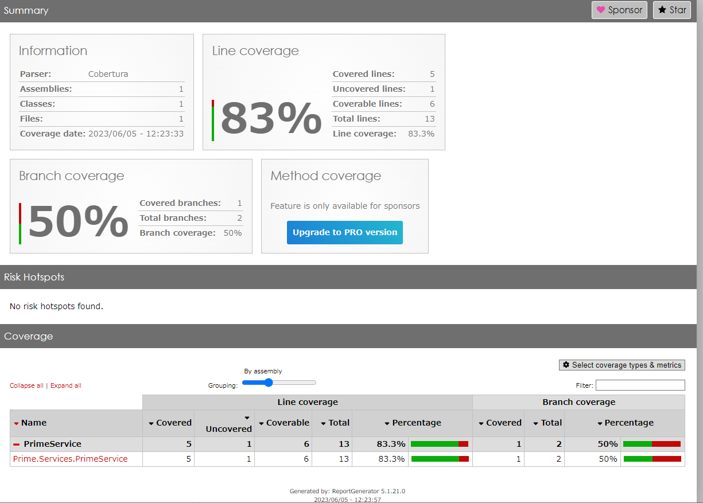

# C#単体テストの練習

## テストの基本

[公式のチュートリアル](https://learn.microsoft.com/ja-jp/dotnet/core/testing/unit-testing-with-dotnet-test)を実践して基本的な内容を理解した。

## カバレッジ

[ここ](https://learn.microsoft.com/ja-jp/dotnet/core/testing/unit-testing-code-coverage?tabs=windows)を見ながらカバレッジも出せるようにしようとしたが、関係なさそうな内容も多かった。

レポート生成するツールのインストールは、一度やっておけばOK。

```sh
dotnet tool install -g dotnet-reportgenerator-globaltool
```

上述のチュートリアルで作ったプロジェクトに対して必要な操作は、以下だけだった。

```sh
cd .\PrimeService.Tests\
dotnet test --collect:"XPlat Code Coverage"
reportgenerator -reports:"TestResults\e82ce44b-f75a-48bf-a8ff-c70a03f57a63\coverage.cobertura.xml" -targetdir:"coveragereport" -reporttypes:Html
```


